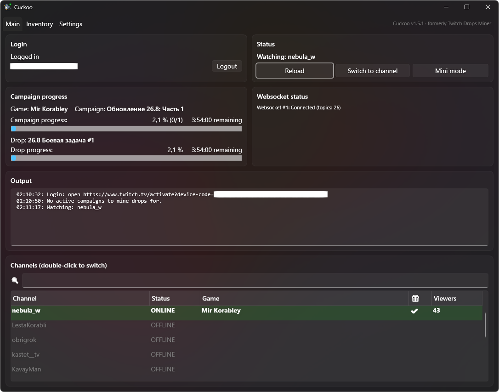
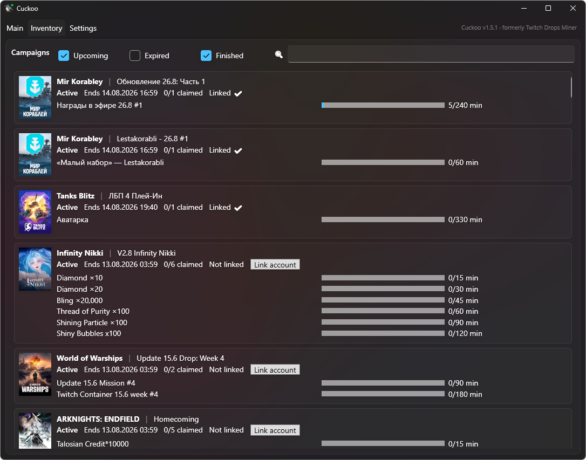
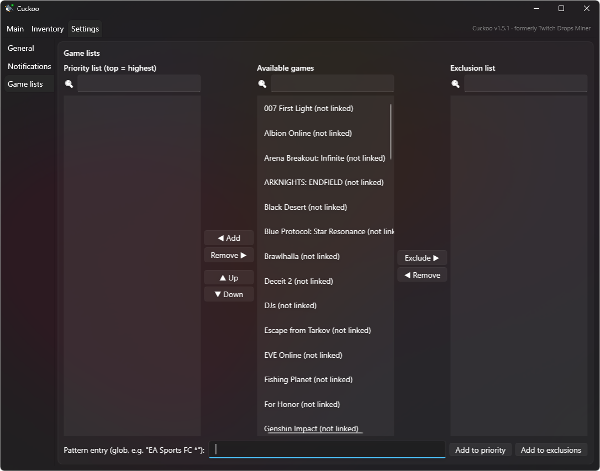
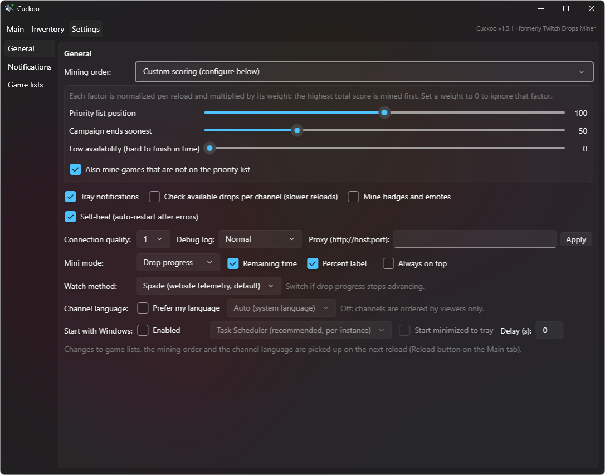
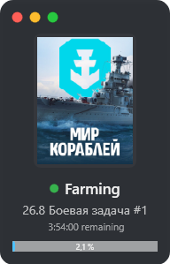
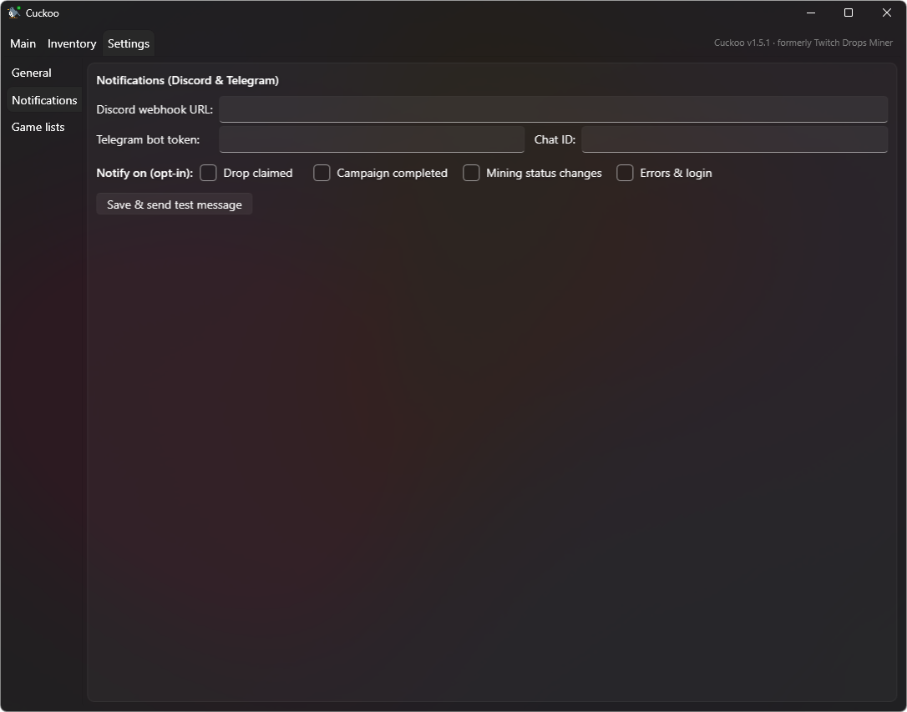

# Cuckoo

*Formerly Twitch Drops Miner.*

Cuckoo AFK-mines timed Twitch drops. It talks to Twitch's own GraphQL and PubSub endpoints
directly, so it never downloads a single frame of video: it just tells Twitch "I watched another
minute", follows the campaigns you care about, hops channels when one goes offline, and claims
drops the moment they finish.

It started as a rewrite of [DevilXD's Twitch Drops Miner](https://github.com/DevilXD/TwitchDropsMiner)
(Python + Tkinter) into a native Windows app. I wanted something that felt like a real desktop
program rather than a script with a GUI bolted on, and I wanted to run several accounts side by
side without them stepping on each other. That turned into a full C#/WPF port with its own
mining-order engine, a compact widget mode, push notifications, and a fair amount of plumbing
around not falling over.

Ships as a single self-contained `Cuckoo.exe`. The tray icon carries a status dot: gray for idle,
yellow for maintenance, green while mining, red on error.



*(The account name and device code are blanked out in these screenshots. Everything else is a
live session.)*

## What it actually does

- **Logs in with the OAuth device-code flow.** You confirm a short code on twitch.tv/activate,
  so no password ever touches the app. The session token lands in `auth.json` next to the exe.
- **Pulls active drop campaigns** through Twitch's persisted GraphQL queries, then works out
  which games to mine from your priority and exclusion lists.
- **Keeps up to 8 sharded PubSub websockets open** (50 topics each, so roughly 199 channels) for
  live stream up/down and viewer-count events. Sharding is what lets it track that many channels
  on one account.
- **Sends a "minute watched" event every ~59 seconds** for whichever channel it is on. That is the
  whole trick: Twitch counts the event, not the video stream.
- **Switches channels on its own** when the current one goes offline, or when a channel for a
  higher-priority game comes online.
- **Claims drops automatically** as soon as they complete, and notices when a whole campaign is done.

### Two ways to report a watched minute

Under Settings > General > "Watch method" you can pick between **Spade** (a POST to the
per-channel telemetry endpoint, which is what the website itself does, and the default) and **GQL**
(the `sendSpadeEvents` mutation). Twitch periodically breaks one of the two. If drop progress
stalls while everything else looks healthy, flip to the other one. The change applies from the
next watch tick, no restart needed.

There is also a fallback inside the watch loop: if a minute is nearly up and Twitch has gone quiet
about progress, the app queries the current drop over GQL rather than blindly assuming the minute
counted.

## Requirements

- Windows 10 or 11
- [.NET 10 SDK](https://dotnet.microsoft.com/download) to build. The published exe is
  self-contained, so end users need nothing installed.

## Building

```powershell
dotnet build Cuckoo.slnx
```

```powershell
dotnet run --project src/Cuckoo
```

The tests cover the parts worth pinning down: the mining-order scoring, the glob matching behind
the game lists, and the settings self-heal path.

```powershell
dotnet test
```

Single-file release build:

```powershell
dotnet publish src/Cuckoo -c Release -r win-x64 --self-contained -p:PublishSingleFile=true -o dist
```

For a release plus the self-extracting updater (needs [7-Zip](https://www.7-zip.org/) installed):

```powershell
./build.ps1
```

That drops the published app into `dist/` and builds `dist/Cuckoo-Setup.exe`, a 7-Zip SFX archive.
Running it shows a folder picker: point it at an instance folder and extract to update that copy
in place. The archive holds only app binaries, so your `settings.json`, `auth.json` and `cache/`
survive the update untouched.

## Getting started

1. Start the app and click **Open activation page** on the login card, then type the shown code on
   Twitch. Codes last 30 minutes and the app requests a fresh one automatically if yours expires.
2. The **Inventory** tab now lists every campaign your account can see. Linking game accounts on
   the [campaigns page](https://www.twitch.tv/drops/campaigns) makes more of them eligible, and
   there is a "Link account" button next to campaigns that need it.

   
3. On **Settings > Game lists**, add games to the priority list (or switch to a mining order that
   mines everything not excluded), then hit **Reload** on the Main tab.
4. Watch it work. The Main tab shows campaign and drop progress, the channel list, websocket
   status, and a log pane. Double-click any channel to switch to it manually.

Both game lists accept glob patterns, so `EA Sports FC *` covers every FC title without you
listing them one by one.



## Mining order

"Which game next?" turned out to be the most interesting design question in the project, so there
are six modes under Settings > General:

| Mode | Behaviour |
|------|-----------|
| Priority only | Mines only what is on the priority list, in list order. Everything else is ignored. |
| Ending soonest | Mines any non-excluded game, preferring the campaign closest to its end date. |
| Low availability first | Same, but prefers campaigns that are hardest to finish in time. |
| Priority, then linked | Priority list in order, then games with a linked account by end date. |
| Priority scored | Priority games get up to 100 points for list position plus up to 100 for ending soonest; highest total wins. |
| Custom | You set the weights yourself. |

Custom mode exposes three sliders (priority position, ending soonest, low availability, each 0 to
200) and a toggle for whether non-priority games are eligible at all. Every factor is
rank-normalised to 0..1 per reload before being weighted, which keeps one outlier campaign with a
weird end date from dominating the ordering.



## Channel language preference

Settings > General > "Channel language" biases channel selection toward your own language.
Channels get grouped into tiers, **your language, then English, then everything else**, and within
each tier the one with the most viewers wins.

This uses Twitch's real stream-language filter (the one the broadcaster sets), not stream tags,
which are freeform text and useless for this. The cost is one directory query per tier, though
later tiers get skipped as soon as enough channels turn up. It defaults to your Windows language
and is off by default, so it costs nothing unless you switch it on.

## Mini mode

The **Mini mode** button on the Main tab (also "Toggle mini view" in the tray menu) swaps the
whole GUI for a small frameless widget: box art, status dot, current drop, progress bar. Drag it
wherever you like and it remembers the position. The macOS-style dots do exit (red), hide to tray
(yellow), and back to the full window (green).



Under Settings > General > "Mini mode" you choose what the bar tracks (drop progress, campaign
progress, or nothing), whether the remaining-time and percent labels show, and whether it stays on
top. The choice persists across restarts, so you can have it come back up as a widget.

## Running several accounts

Every copy of the app in its own folder is completely independent: separate `settings.json`,
`auth.json`, `cache/`, and logs. To mine a second account, copy the folder and run it. The
single-instance guard is a mutex scoped to a hash of the install path, so two folders run happily
at the same time and only launching the *same* copy twice is blocked.

**Start with Windows** is per-instance too, with two mechanisms:

- **Task Scheduler** (the default, and what I would use on a server): a per-instance logon task
  that runs in your interactive session so the GUI is visible, with an optional startup delay.
- **Registry Run key**: a per-instance `HKCU\...\Run` value.

Both need an interactive logon for the GUI to appear, so for an unattended server reboot you want
Windows auto-logon enabled for that user. Instances upgraded from an older build migrate their old
shared autostart entry to the per-instance form on first launch, which was the fix for a genuinely
annoying bug where a second instance enabling autostart silently disabled the first.

To update every instance at once, run `dist/Cuckoo-Setup.exe` and extract into each instance
folder in turn.

## Discord and Telegram notifications

The Notifications tab sets up one-way push messages. Each event type is opt-in and everything is
off by default:

- **Drop claimed**
- **Campaign completed**
- **Mining status changes** (started, switched channel, went idle)
- **Errors and login** (the login message includes the activation URL and code, so you can log a
  headless instance back in from your phone)

For Discord, create a channel webhook (Settings > Integrations > Webhooks > New Webhook > Copy URL)
and paste the URL. No bot needed. For Telegram, make a bot via
[@BotFather](https://t.me/BotFather), paste the token, and set the chat ID (e.g. from
[@userinfobot](https://t.me/userinfobot)); message your bot once so it is allowed to reply to you.
Then hit **Save & send test message**.



Every message carries the logged-in account name, which matters once you are running four
instances and a "drop claimed" ping needs to say *which* account claimed it. Leaving a
destination's fields empty turns that channel off. Sending happens on a background thread and can
never interrupt mining; failures go to the logs.

## Files next to the exe

| File | Purpose |
|------|---------|
| `settings.json` | your preferences (game lists, mining order, tray, proxy, notifications) |
| `settings.json.bak` | last known good config, used by the self-heal path |
| `auth.json` | Twitch session token. **Keep this private.** |
| `logs/debug.log` | diagnostic detail: state changes, auth steps, websocket topic churn |
| `logs/info.log` | normal operation (login, inventory, channel switches) |
| `logs/error.log` | warnings and errors only |
| `cache/` | downloaded campaign box art, 7-day expiry |

Logs rotate at 5 MB, keeping the previous file as `*.log.old`. Debug verbosity is set under
Settings > General > "Debug log" and applies immediately: **Off** writes no debug log at all,
**Normal** is diagnostic detail without the high-frequency noise, and **Verbose** adds full
tracing (every HTTP request, GQL operation, websocket message and watch tick) for when you are
actually hunting something. Info and error logs are always written.

## Not falling over

This is the part I care about most, because the app is meant to run for weeks unattended.

- **Nothing crashes the process.** UI-thread exceptions, unobserved task exceptions and app-domain
  exceptions are all caught and logged. A failing UI update or a dead Discord webhook cannot take
  the mining core with it.
- **Self-heal** (Settings > General, on by default): when the mining core hits a fatal error it is
  shut down cleanly and restarted with exponential backoff, roughly 11 seconds growing to a 5
  minute cap, or 30 minutes after a captcha. The backoff resets after 15 minutes of healthy
  running, so an unrelated hiccup next month starts from a short delay again. Turn it off if you
  prefer the classic "stop and show the error" behaviour.
- **The config heals itself too.** Settings are written with a write-then-rename so a crash
  mid-save cannot truncate the file, every successful save keeps a `.bak`, and a damaged
  `settings.json` is copied aside as `.corrupt` and then salvaged field by field: whatever still
  parses is kept, the rest falls back to defaults. Failing that it restores the `.bak`. The file
  is versioned, so format changes get migrated forward on load rather than resetting your setup.
- **Logging never blocks.** Writes go through a background channel, and the logger swallows its own
  failures (disk full, locked file) rather than propagating them.

## Project layout

```
src/Cuckoo
├── Core/            # TwitchClient state machine, AuthState, WebsocketPool, GQL, mining order
├── Models/          # Game, Channel/Stream, DropsCampaign/TimedDrop/Benefit
├── Services/        # Settings, AutostartService, Logger, ImageCache, NotificationService
├── ViewModels/      # MainViewModel, which implements the IMinerGui surface the core talks to
├── MainWindow.xaml  # Main / Inventory / Settings tabs plus the tray icon
├── MiniWindow.xaml  # the compact widget
└── App.xaml         # startup wiring, single-instance guard, self-heal loop

tests/Cuckoo.Tests   # mining order, game-list globs, settings self-heal
```

The mining core knows nothing about WPF. It talks to an `IMinerGui` interface that the view model
implements, which is what makes the mini window and the full window interchangeable and would make
a headless build a small job rather than a rewrite.

## Things worth knowing

- Watching a stream in a browser on the same account while mining will confuse Twitch's progress
  reporting. That is true of the original miner as well; it is Twitch's behaviour, not a bug here.
- The remaining-time countdown ticks down a minute and then waits for Twitch's next progress
  report, so it can look like it stalls briefly. Same as the original.
- `--tray` on the command line starts the app minimized to the tray.
- Persisted GraphQL query hashes rotate on Twitch's side every so often. When that happens,
  inventory or directory calls start failing and the hashes in `Core/Constants.cs` need refreshing.

## Credits

The protocol work, the GraphQL query set and the overall approach come from
[DevilXD/TwitchDropsMiner](https://github.com/DevilXD/TwitchDropsMiner) (MIT). This is an
independent C#/WPF reimplementation, not a fork of that codebase.

## License

MIT, see [LICENSE](LICENSE). Not affiliated with or endorsed by Twitch. Use at your own
risk: automating watch progress may conflict with Twitch's Terms of Service.
